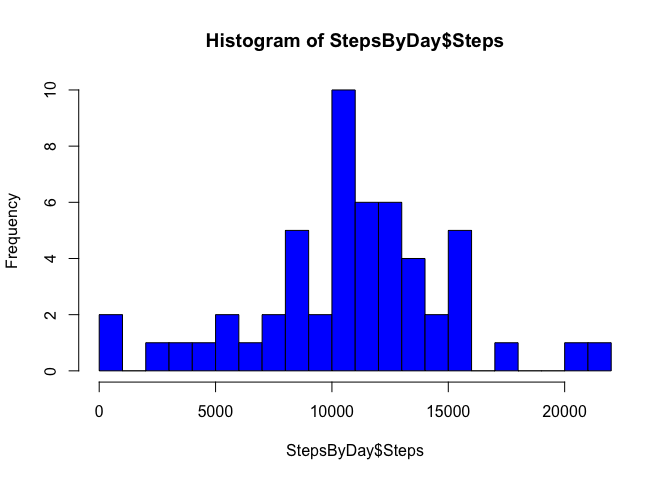
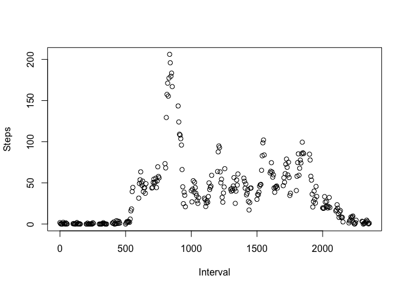
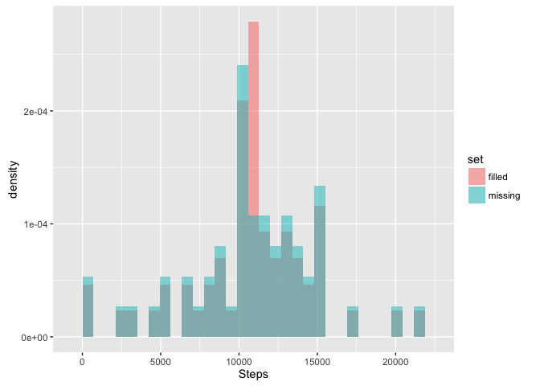

# Reproducible Research: Peer Assessment 1
Peter Dunham  
February 22, 2016  

## Loading and preprocessing the data

The raw data "activity.csv"  to be included in the GitHub repo. This .csv file is to be extracted from the activity.zip file.  The file can also be downloaded from:  https://www.coursera.org/learn/reproducible-research/peer/gYyPt/course-project-1

Eitherway, the working directory should be set to the directory that contains "activity.csv"

After setting your working directory:

```r
   #getwd('YOUR DIRECTORY PATH HERE')
```

Then you can load activity data using "read.csv"

```r
   RawActivityData<-read.csv(paste0(getwd(),'/activity.csv'))
```

The following displays a small subset of the data to show how "interval" fields relate to
5 minute intervals in a 24 hour date:

```r
   RawActivityData[861:868,]
```

```
##     steps       date interval
## 861     0 2012-10-03     2340
## 862     8 2012-10-03     2345
## 863     0 2012-10-03     2350
## 864     0 2012-10-03     2355
## 865    47 2012-10-04        0
## 866     0 2012-10-04        5
## 867     0 2012-10-04       10
## 868     0 2012-10-04       15
```

## What is the average daily activity pattern?

Histogram of the total number of steps taken each day

```r
StepsByDay<-aggregate(list(Steps=RawActivityData$steps),list(Date=RawActivityData$date),sum)
hist(StepsByDay$Steps, col="blue", breaks=20)
```



### What is mean total number of steps taken per day?

What is mean total number of steps taken per day?


```r
mean(StepsByDay$Steps, na.rm=TRUE)
```

```
## [1] 10766.19
```

What is the median number of steps taken per day?


```r
median(StepsByDay$Steps, na.rm=TRUE)
```

```
## [1] 10765
```

### 5-interval activity

Make a time series plot (i.e. 𝚝𝚢𝚙𝚎 = "𝚕") of the 5-minute interval (x-axis) and the average number of steps taken, averaged across all days (y-axis)


```r
ByInterval<-aggregate(list(Steps=RawActivityData$steps),list(Interval=RawActivityData$interval),na.rm=TRUE, na.action=NULL,mean)
plot(ByInterval)
```



### The 5-minute interval that, on average, contains the maximum number of steps

Which 5-minute interval, on average across all the days in the dataset, contains the maximum number of steps?


```r
ByInterval[ByInterval$Steps == max(ByInterval$Steps),]
```

```
##     Interval    Steps
## 104      835 206.1698
```

On average 8:35-8:40AM has the maximum number of streps.

## Inputing missing values

Number of missing cases:

```r
   nrow(RawActivityData)-NROW(na.omit(RawActivityData))
```

```
## [1] 2304
```

Replacing data with mean of interval 

```r
library(dplyr)

#Function to replace with mean of interval
myreplace<-function(interval){
  as.integer(ByInterval$Steps[match(interval, ByInterval$Interval)])
}

FilledActivityData<-mutate(RawActivityData,steps = ifelse(!complete.cases(RawActivityData),myreplace(RawActivityData$interval), RawActivityData$steps))
```

This shows a small subset of filled data.

```r
   FilledActivityData[2250:2260,]
```

```
##      steps       date interval
## 2250    20 2012-10-08     1925
## 2251    27 2012-10-08     1930
## 2252    40 2012-10-08     1935
## 2253    30 2012-10-08     1940
## 2254    25 2012-10-08     1945
## 2255    45 2012-10-08     1950
## 2256    33 2012-10-08     1955
## 2257    19 2012-10-08     2000
## 2258    19 2012-10-08     2005
## 2259    19 2012-10-08     2010
## 2260    33 2012-10-08     2015
```

### Histogram of the total number of steps taken each day after missing values are inputed


```r
library(ggplot2)
ByDateMissing<-aggregate(list(Steps=RawActivityData$steps),list(Date=RawActivityData$date),sum)
ByDateMissing$set<-'missing'


ByDateFilled<-aggregate(list(Steps=FilledActivityData$steps),list(Date=FilledActivityData$date),sum)
ByDateFilled$set<-'filled'

compare<-rbind(ByDateFilled,ByDateMissing)

ggplot(compare, aes(Steps, fill = set)) + geom_histogram(alpha = 0.5, aes(y = ..density..), position = 'identity')
```




## Are there differences in activity patterns between weekdays and weekends?
